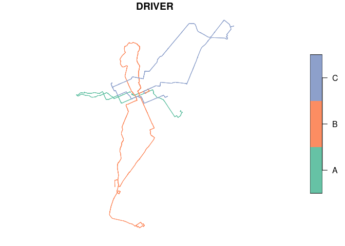

<!-- README.md is generated from README.Rmd. Please edit that file -->

# ndsbr 

<!-- badges: start -->

[](https://github.com/pabsantos/ndsbr/actions/workflows/R-CMD-check.yaml)
<!-- badges: end -->

The goal of ndsbr is to help you **load**, **manipulate** and
**analyze** the data sample of the [Brazilian Naturalistic Driving Study
(NDS-BR)](http://www.tecnologia.ufpr.br/portal/ceppur/estudo-naturalistico-de-direcao-brasileiro/).

## Overview

This package provides four main categories of functions: `nds_create`,
`nds_calc`, `nds_join`, and `nds_download`. `nds_create` functions are
used to create spatial objects in sf format, using the naturalistic data
as input:

- `nds_create_points`
- `nds_create_lines`

`nds_calc` functions can be used to extract basic information of the
naturalistic sample (traveled time or traveled distance) and
safety-related variables, such as speeding:

- `nds_calc_dist`
- `nds_calc_time`
- `nds_calc_speeding`

`nds_join` functions performs spatial join operations between ndsbr data
and other spatial data, like road axis (`nds_join_axis`), neighborhood
data (`nds_join_neigh`), and speed limit data (`nds_join_spdlimit`).

`nds_load_data` is used to load naturalistic data and `nds_download`
functions ( `nds_download_sf`, `nds_download_cwb_osm`) can be used to
download spatial data and import into the project environment.

A brief presentation (in portuguese) about `ndsbr` can be [accessed
here](https://rpubs.com/pabsantos/stpr_ndsbr).

## Installation

You can install the current version of ndsbr like so:

``` r
# install.packages("devtools")
devtools::install_github("pabsantos/ndsbr")
```

## Example

This is a basic example which shows you how to load NDS-BR data and
calculate traveled distances. First, `nds_load_data` loads the sample
from all NDS-BR files inside a specific folder, defined by the user.

``` r
library(ndsbr)
path <- system.file("extdata", package = "ndsbr") ## Example files location
nds_data <- nds_load_data("driver", path)

head(nds_data, n = 5)
#> # A tibble: 5 × 34
#>   DRIVER  LONG   LAT DAY       DAY_CORRIGIDO `03:00:00`  TRIP ID    PR         H
#>   <chr>  <dbl> <dbl> <chr>     <chr>         <chr>      <dbl> <chr> <chr>  <dbl>
#> 1 A      -49.2 -25.5 26/8/2019 26/8/2019     22:17:27       5 A05   19:17…    NA
#> 2 A      -49.2 -25.5 26/8/2019 26/8/2019     22:17:28       5 A05   19:17…     0
#> 3 A      -49.2 -25.5 26/8/2019 26/8/2019     22:17:29       5 A05   19:17…     0
#> 4 A      -49.2 -25.5 26/8/2019 26/8/2019     22:17:30       5 A05   19:17…     0
#> 5 A      -49.2 -25.5 26/8/2019 26/8/2019     22:17:31       5 A05   19:17…     0
#> # ℹ 24 more variables: M <dbl>, S <dbl>, TIME_ACUM <dbl>, SPD_MPH <dbl>,
#> #   SPD_KMH <dbl>, ACEL_MS2 <dbl>, HEADING <dbl>, ALTITUDE_FT <dbl>,
#> #   VALID_TIME <chr>, TIMESTAMP_GPS <chr>, CPOOL <chr>, CPOOLING_CHECKED <chr>,
#> #   WSB <chr>, UMP_YN <chr>, UMP <chr>, PICK_UP <chr>, ACTION <chr>,
#> #   GPS_FILE <chr>, CIDADE <chr>, BAIRRO <chr>, NOME_RUA <chr>,
#> #   HIERARQUIA_CWB <chr>, HIERARQUIA_CTB <chr>, LIMITE_VEL <chr>
```

Creating a sf object with linestring geometry using `nds_create_lines`

``` r
nds_lines <- nds_create_lines(nds_data, x = LONG, y = LAT)

plot(nds_lines["DRIVER"])
```



Finally, `nds_calc_dist` extracts traveled distance, grouped by a
variable defined by the user.

``` r
nds_dist <- nds_calc_dist(nds_lines, geom = wkt_lines, by = DRIVER)
nds_dist
#> # A tibble: 3 × 2
#>   DRIVER   DIST
#>   <chr>   <dbl>
#> 1 A      22508.
#> 2 B      51529.
#> 3 C      37736.
```
