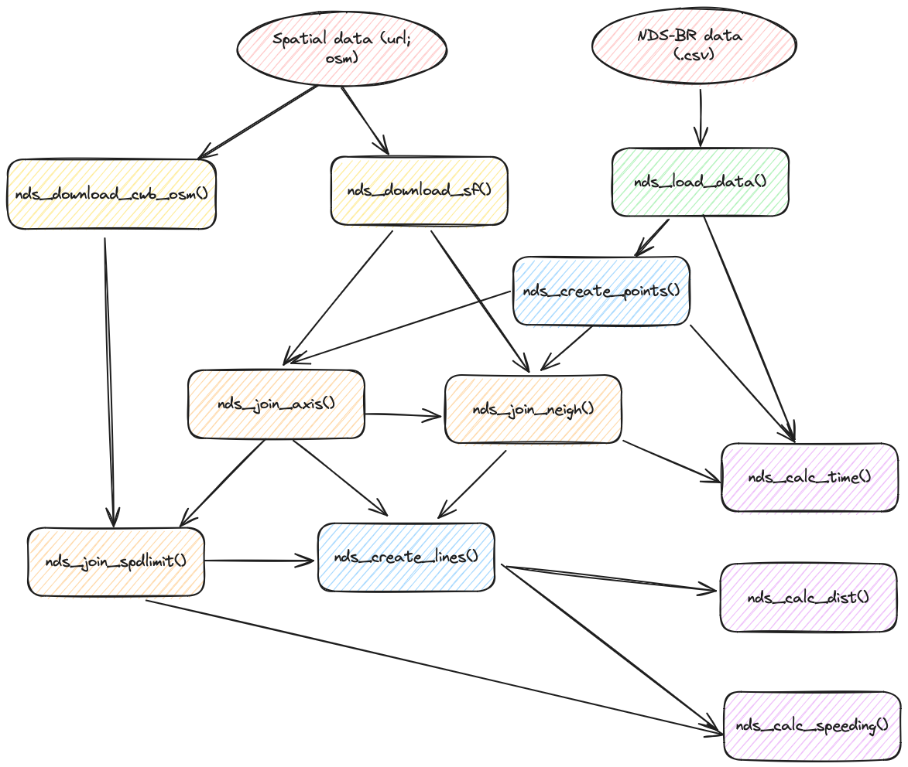

```{r, include = FALSE}
knitr::opts_chunk$set(
  collapse = TRUE,
  comment = "#>"
)
```

```{r setup}
library(ndsbr)
```

The `ndsbr` package contains functions and example datasets to help NDS-BR researchers to handle the project's data.

## Instalation

The current version of `ndsbr` can be installed from [GitHub](https://github.com/) with:

``` r
# install.packages("devtools")
devtools::install_github("pabsantos/ndsbr")
```

## Structure

The following diagram shows the structure of this package (WIP)

{width="500"}
